# School District Analysis
Performing analysis on student funding and students’ standardized test scores data to showcase trends in school performance.

## Overview of Project
Maria is a chief data scientist for a city school district responsible for analyzing information from a variety of sources, and in a variety of formats. She is tasked with preparing all the standardized test data for analysis, reporting, and presentation to provide insights about performance trends and patterns. These insights will assist the school board and superintendent in making decisions regarding the school budgets and priorities at the school and district levels. The purpose of this project is to help Maria perform analysis on student funding and students’ standardized test scores data to showcase trends in school performance at the school and district levels using pandas. Also, repeat the analysis after changing Thomas High School ninth-graders' scores with nan and report the effect on the overall analysis.

## Results 

### District summary
- Effect on district summary after Thomas High School ninth-graders' scores were changes to nan:
    - Average Math Score and was lowered by 0.1. 
    - % Passing Math, % Passing Reading and % Overall Passings were lowered by 1%.

District summary result:
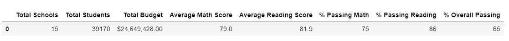 

District summary for data with null values result:
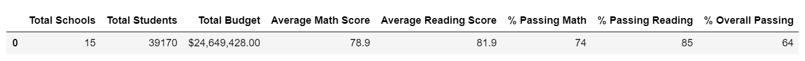 

### School summary
- Effect on school summary after Thomas High School ninth-graders' scores were changes to nan:
    - Average Math Score and Average Reading Score were lowered by 0.1.
    - % Passing Math, % Passing Reading and % Overall Passings were lowered by 26.96%, 27.65%, and 25.87% respectively.
 
School summary result:
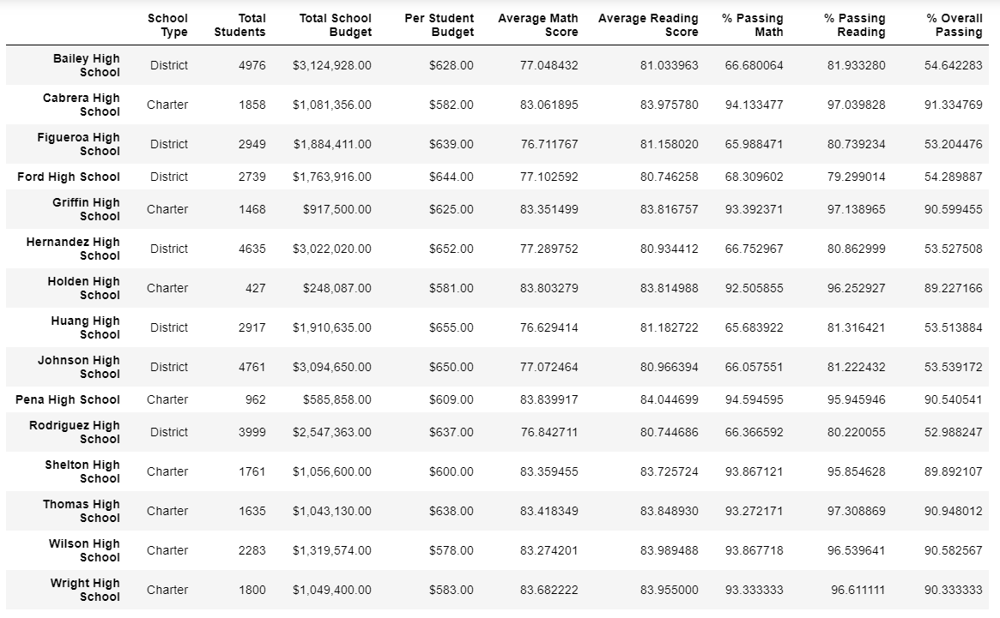 

School summary for data with null values result:
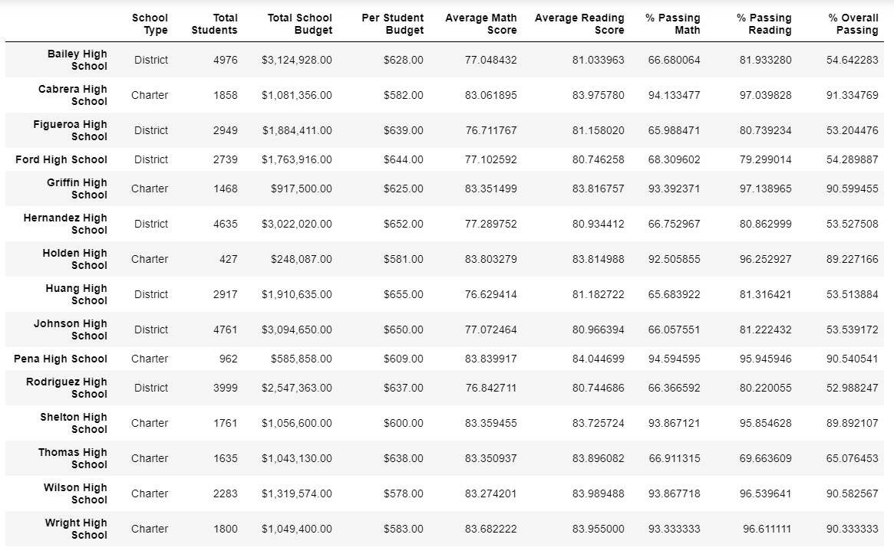 

### Top schools
- Thomas High School was the top 2nd school but after the score change, it was removed from the Top 5 list. Overall Passing % was dropped by 25.87%.

Top schools:
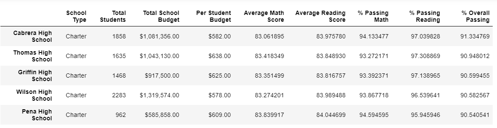 

Top schools for data with null values: 
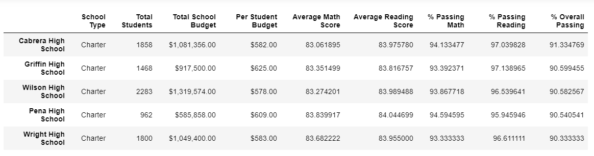 

### Bottom schools
- Thomas High School was not in the bottom 5 in both cases. 

Bottom schools:
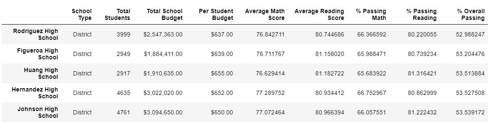 

Bottom schools for data with null values:
 

### Ninth-grade math scores by schools
- Thomas High School's average ninth grade math score was 83.6% but after the score change data was replaced with nan.

Ninth-grade math scores by schools:
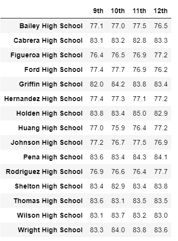 

Ninth-grade math scores by schools for data with null values:
 

### Ninth-grade reading scores by schools
- Thomas High School's average ninth-grade reading score was 83.7% but after the score change data was replaced with nan.

Ninth-grade reading scores by schools:
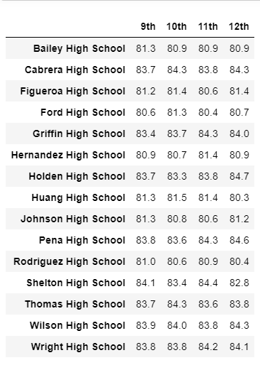 

Ninth-grade reading scores by schools for data with null values:
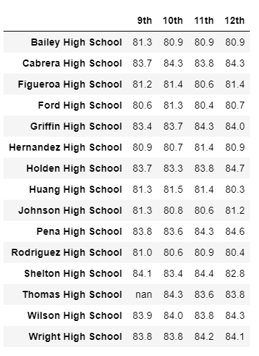 

### Scores by school spending
- Thomas High School is part of the $630-644 spending range per student.
- Effect on scores by school spending data after Thomas High School ninth-graders' scores were changes to nan:
    - % Passing Math, % Passing Reading and % Overall Passings were lowered by 6%, 7%, and 7% respectively. 

Scores by school spending:
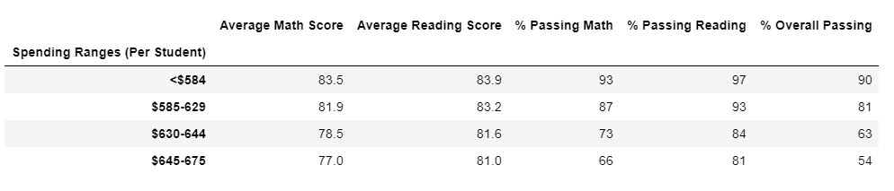 

Scores by school spending for data with null values:
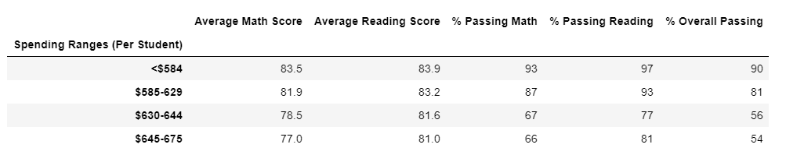 

### Scores by school size
- Thomas High School is part of the Medium (1000-2000) school size. 
- Effect on scores by school size data after Thomas High School ninth-graders' scores were changes to nan:
    - All % Passing Math, % Passing Reading and % Overall Passings were lowered by 6%.

Scores by school size:
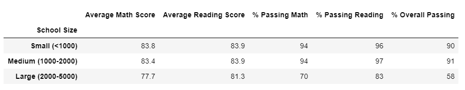 

Scores by school size for data with null values:
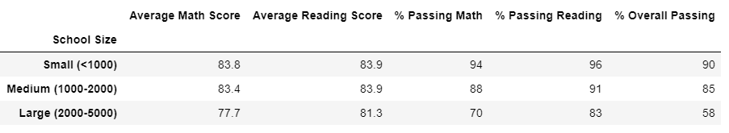 

### Scores by school type
- Thomas High School is part of the Charter school type.
- Effect on scores by school type data after Thomas High School ninth-graders' scores were changes to nan:
    - % Passing Math, % Passing Reading and % Overall Passings were lowered by 4%, 4%, and 3% respectively.

Scores by school type:
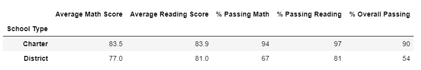 

Scores by school type for data with null values:
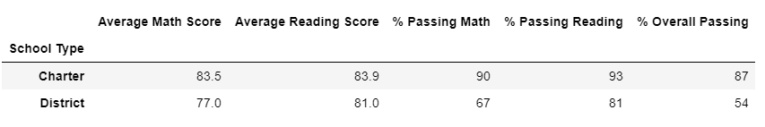 

## Summary
Four major changes in the updated school district analysis after reading and math scores for the ninth grade at Thomas High School were replaced with NaNs:
1. Thomas High School  % Passing Math, % Passing Reading and % Overall Passings were lowered by 26.96%, 27.65%, and 25.87% respectively. Thomas High School was the top 2nd school but after the score change, it was removed from the Top 5 list. 
2. $630-644 spending range per student % Passing Math, % Passing Reading and % Overall Passings were lowered by 6%, 7%, and 7% respectively. 
3. Medium (1000-2000) school size % Passing Math, % Passing Reading, and % Overall Passings were lowered by 6%.
4. Charter school type % Passing Math, % Passing Reading and % Overall Passings were lowered by 4%, 4%, and 3% respectively.

